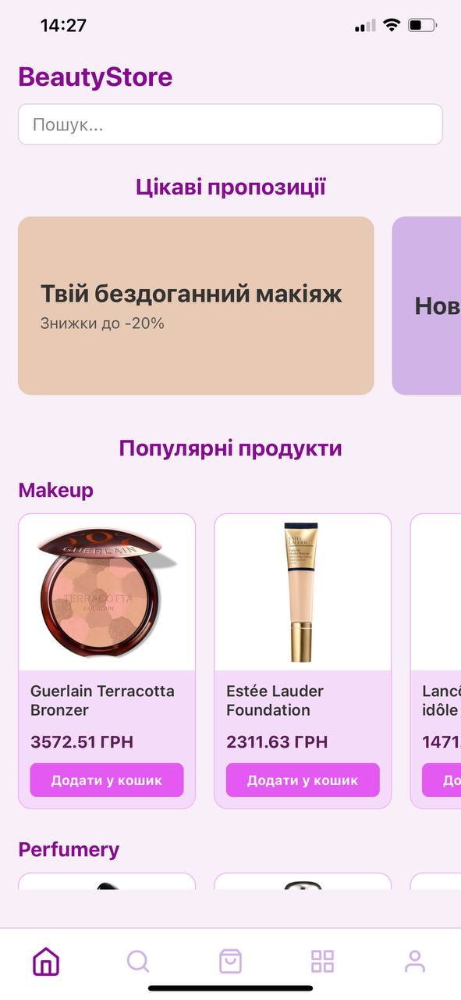
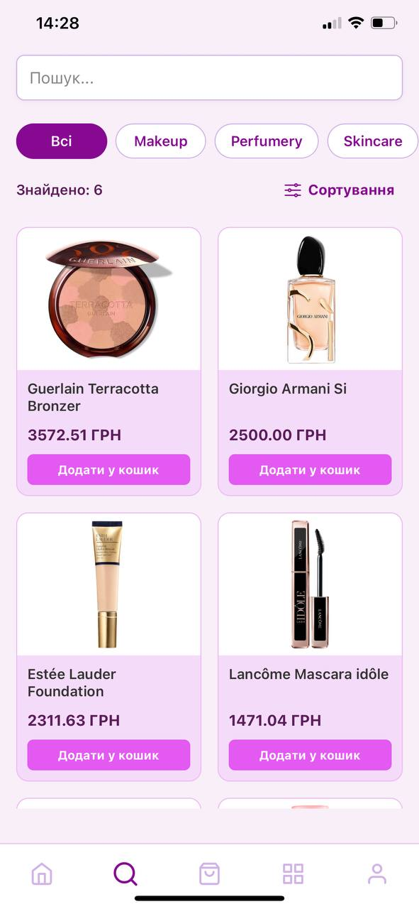
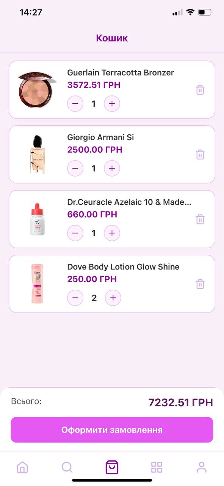

# BeautyStore — Мобільний додаток для магазину косметики 

**BeautyStore** — це сучасний кросплатформений мобільний додаток, розроблений як частина кваліфікаційної роботи. Проєкт являє собою повноцінну систему для онлайн-торгівлі, що включає клієнтський інтерфейс та адміністративну частину.

## Ключові особливості

### Для користувачів:
- **Інтуїтивний каталог:** Зручна навігація, фільтрація за категоріями та сортування товарів.
- **Функція «Натякнути про подарунок»:** Можливість ділитися товаром через месенджери, що підвищує залученість та продажі.
- **Кошик та замовлення:** Реалізовано повний цикл — від вибору кількості до підтвердження адреси доставки.

### Для адміністратора:
- **Керування контентом (CRUD):** Повний інтерфейс для створення, читання, оновлення та видалення товарів і категорій у реальному часі.
- **Обробка замовлень:** Система моніторингу нових надходжень та керування статусами замовлень.
- **Модуль аналітики:** Відстеження статистики продажів, популярних товарів та активності користувачів для прийняття бізнес-рішень.

## Технологічний стек
- **Frontend:** [React Native](https://reactnative.dev/) + [Expo](https://expo.dev/) (Cross-platform iOS/Android).
- **Backend:** [Django REST Framework](https://www.django-rest-framework.org/) (Керування базою даних та API).
- **Мова:** [TypeScript](https://www.typescriptlang.org/) (Типізований та надійний код).
- **Навігація:** Expo Router.
- **State Management:** Context API.
- **Database:** PostgreSQL.

## Скріншоти інтерфейсу

| Головна | Каталог | Кошик |
| :---: | :---: | :---: |
|  |  |  |

## Як запустити проект локально

1. Клонуйте репозиторій:
   ```bash
   git clone https://github.com/OnofreichukIryna/BeautyApp.git
   